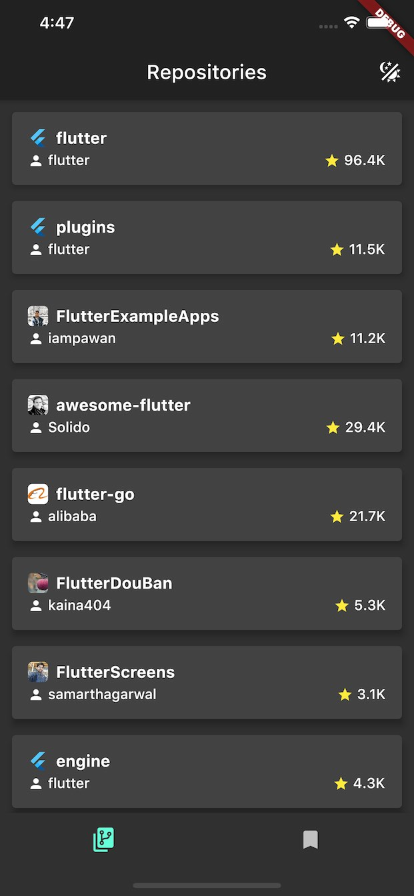
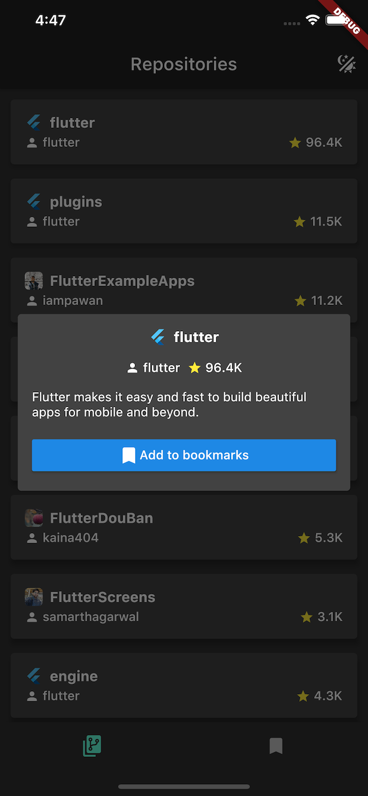
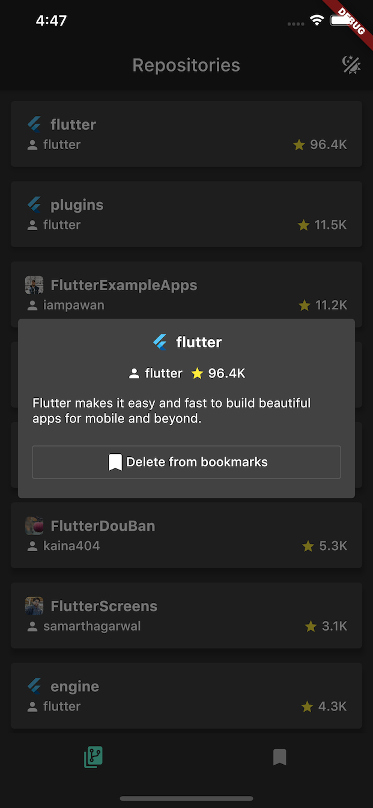
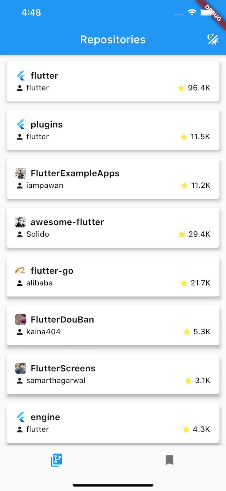

# Flutter GitHub repo explorer

This is an example application with Flutter.  
A lot of popular packages are used in the example:

- [river_pod](https://github.com/rrousselGit/river_pod)
- [flutter_hooks](https://github.com/rrousselGit/flutter_hooks)
- [state_notifier](https://github.com/rrousselGit/state_notifier)
- [freezed](https://github.com/rrousselGit/freezed)
- etc..

## Summary

- Search GitHub repositories with specified keyword (e.g.: `Flutter`).
- Display fetched GitHub repository data.
- Can look through repository data detail.
- Can change `light/dark` theme.
- Can add repository data to Bookmarks.
- Can remove repository data from Bookmarks.

|  |  |  |
| ---------------------- | ---------------------- | ---------------------- |
|  |  |  |

## TODO
- [ ] Add more examples using river_pod
  - [ ] Family
  - [ ] `.autoDispose`
- [ ] Search
- [ ] Pagination
- [ ] Retry handling
- [ ] Refine whole designs
- [ ] Testing
